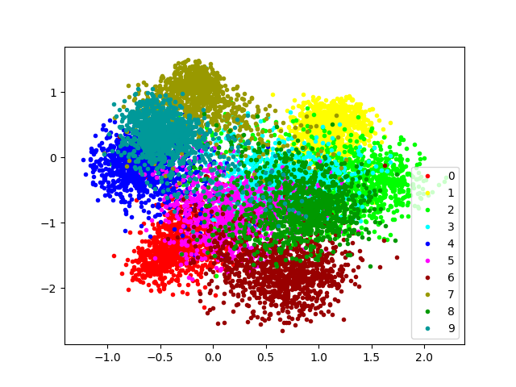
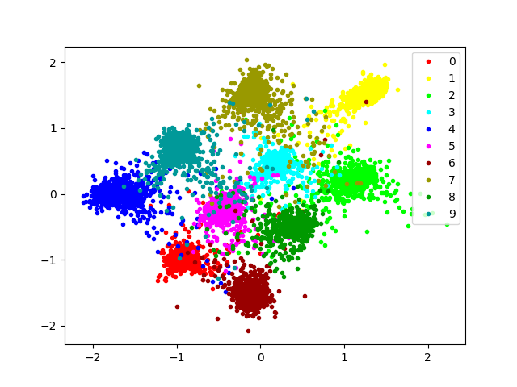

# siamese-network
This is a test program for siamese-network
The original implementation is
[here](https://github.com/mitmul/chainer-siamese) by mitmul.

The difference between the original repo are...
* Using chainer 3.2
* Using Trainer with powerfull extensions

## Mnist Demo
### epoch 1

### epoch 16

